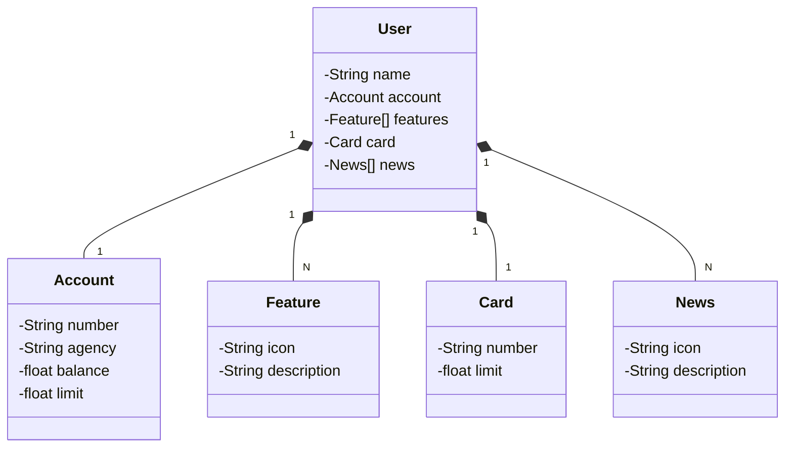

# Publicando Sua API REST na Nuvem Usando Spring Boot 3, Java 17 e ~~Railway~~ Render

Ministrado por Venilton Falvo Jr. através da plataforma da DIO no Bootcamp Santander Fullstack Java Angular.

O projeto foi criado através do [Spring Initializr][(https://start.spring.io/#!type=gradle-project&language=java&platformVersion=3.1.4&packaging=jar&jvmVersion=17&groupId=dio&artifactId=santander-dev-2023&name=santander-dev-2023&description=Java%20RESTful%20API&packageName=dio.santander&dependencies=web,data-jpa,h2,postgresql)](https://start.spring.io/), importado e descompactado.

O projeto não foi publicado no Railway pois a versão de teste não suporta mais o versionamento do github, em vez disso, foi publicado no [Render](https://render.com/) com o banco de dados PostgreSQL gratuito que expira automaticamente em 30 dias.

##Diagrama de Classes

